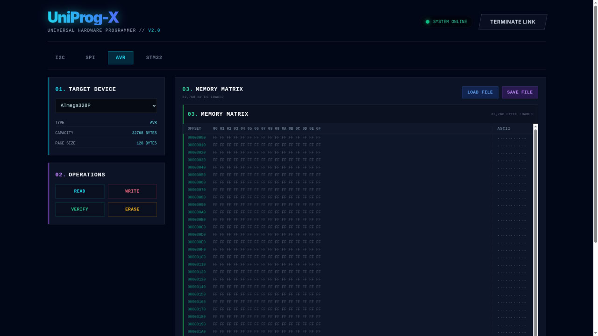

# UniProg-X: Universal Hardware Programmer

UniProg-X is a professional-grade, hyper-scalable, and automated hardware programmer designed for the modern era. Built on the powerful Raspberry Pi Pico (RP2040) and featuring a sleek, web-based interface, it brings hardware programming into the 21st century.



## 🚀 Features

*   **Universal Support**: Native support for I2C EEPROMs, SPI Flash chips, AVR microcontrollers (ISP), and STM32 microcontrollers (SWD).
*   **OPUP Protocol**: Modern binary protocol with CRC32, sequence numbers, and robust error handling.
*   **Web-First Interface**: No drivers needed. Works directly in Chrome, Edge, and Opera via the Web Serial API.
*   **Auto-Detection**: Smart scanning automatically identifies connected chips (I2C & SPI).
*   **Multi-Protocol**: Supports I2C, SPI, AVR ISP, and STM32 SWD protocols.
*   **High Performance**: Optimized transfers with adaptive chunking. Powered by RP2040's dual-core architecture.
*   **Modern UI**: Cyberpunk-themed, responsive interface with glassmorphism and real-time feedback.
*   **Mode-Aware Interface**: Separate tabs for I2C, SPI, AVR, and STM32 with context-specific controls.
*   **Virtualized Hex Editor**: Smoothly handle large binary files with efficient virtualization.
*   **Professional LED Status Indicators**:
    - **Activity LED (GP25)**: Indicates active data transfer.
    - **Status LED (GP23/WS2812)**:
        - **Startup**: Cyan Breathing (Soft fade-in).
        - **Idle**: Breathing current status color.
        - **Busy**: Yellow (25% Brightness Cap).
        - **Success**: Green Breathing (Glitch-free).
        - **Error**: Red Breathing.
        - **Connection**: Blue Solid.
*   **Advanced Features**:
    - **AVR Fuse Editor**: Read/write fuse bits with safety confirmations and presets
    - **STM32 Option Bytes**: View read protection, user flags, and write protection status
*   **Comprehensive Toolset**: Read, Write, Verify, Erase, and File Management (.bin, .hex, .eep).

## 🛠️ Hardware Setup

UniProg-X runs on a standard **Raspberry Pi Pico** (RP2040).

### Pinout Configuration

| Signal | GPIO Pin | Physical Pin | Description |
| :--- | :--- | :--- | :--- |
| **I2C SDA** | GPIO 4 | Pin 6 | I2C Data |
| **I2C SCL** | GPIO 5 | Pin 7 | I2C Clock |
| **SPI IO0/MOSI** | GPIO 19 | Pin 25 | MOSI / IO0 (Quad) |
| **SPI IO1/MISO** | GPIO 16 | Pin 21 | MISO / IO1 (Quad) |
| **SPI IO2 (/WP)** | GPIO 21 | Pin 27 | Write Protect / IO2 (Quad) |
| **SPI IO3 (/HOLD)** | GPIO 22 | Pin 29 | Hold-Reset / IO3 (Quad) |
| **SPI CS** | GPIO 17 | Pin 22 | Chip Select |
| **SPI SCK** | GPIO 18 | Pin 24 | SPI Clock |
| **AVR RESET** | GPIO 20 | Pin 26 | AVR Reset (ISP) |
| **SWD SWCLK** | GPIO 2 | Pin 4 | SWD Clock (STM32) |
| **SWD SWDIO** | GPIO 3 | Pin 5 | SWD Data (STM32) |
| **LED Activity** | GPIO 25 | - | Onboard LED (data transfer) |
| **WS2812 RGB** | GPIO 23 | - | Status indicator LED |
| **GND** | GND | Pin 3, 8, etc. | Ground |
| **3V3** | 3V3(OUT) | Pin 36 | 3.3V Power Supply |

> **Note**: Ensure your target chip operates at 3.3V. For 1.8V or 5V chips, level shifters are required.
> For standard SPI mode, IO2 and IO3 should be pulled HIGH to disable /WP and /HOLD.

## 💾 Supported Chips

### I2C EEPROMs (24CXX / AT24CXX)
*   **Standard**: 24C01, 24C02, 24C04, 24C08, 24C16, 24C32, 24C64, 24C128, 24C256, 24C512
*   **Atmel**: AT24C01 - AT24C512
*   *Auto-detection supported for standard address 0x50*

### SPI Flash (W25QXX / GD25QXX / MX25LXX)

**Verified Chips:**

| Chip | JEDEC ID | Size | Std | Dual | Quad | QPI |
|------|----------|------|-----|------|------|-----|
| **Winbond W25Q80** | 0xEF 0x4014 | 1 MB | ✅ | ✅ | ✅ | ✅ |
| **Winbond W25Q64** | 0xEF 0x4017 | 8 MB | ✅ | ✅ | ✅ | ✅ |
| **Winbond W25Q128** | 0xEF 0x4018 | 16 MB | ✅ | ✅ | ✅ | ✅ |
| **Macronix MX25L3206E** | 0xC2 0x2016 | 4 MB | ✅ | ✅ | ❌* | ❌* |

*\* MX25L3206E is a Dual-only chip without Quad hardware support*

**Also Supported (untested):**
*   **Winbond**: W25Q16, W25Q32, W25Q256
*   **GigaDevice**: GD25Q64C, GD25Q128C
*   **Macronix**: MX25L6433F, MX25L12835F (Quad-capable)

*Auto-detection via JEDEC ID (0x9F)*

### AVR Microcontrollers (ISP)
*   **ATmega**: ATmega328P (32KB), ATmega168 (16KB)
*   **ATtiny**: ATtiny85 (8KB)
*   *In-System Programming (ISP) via SPI protocol*

### STM32 Microcontrollers (SWD)
*   **STM32F1**: STM32F103C8 (64KB), STM32F103CB (128KB)
*   *Serial Wire Debug (SWD) for flash read and RAM write*

## 📦 Installation & Build

### Firmware (RP2040)
1.  Install **PlatformIO** (VS Code extension or CLI).
2.  Navigate to the `firmware/` directory.
3.  Build using the autonomous script:
    ```bash
    ./build.sh
    ```
    *(Alternatively: `pio run -t upload`)*

### Web Client
1.  Install **Node.js** (v16+).
2.  Navigate to the `web-client/` directory.
3.  Install dependencies:
    ```bash
    npm install
    ```
4.  Build for production:
    ```bash
    npm run build
    ```
5.  Start development server (optional):
    ```bash
    npm run dev
    ```
6.  Open `http://localhost:5173` in a compatible browser (Chrome, Edge, Opera).

### CLI Tool (Python)
For testing and debugging without a browser:
```bash
cd cli/
pip install -r requirements.txt
python uniprog.py -p /dev/ttyACM0 ping
```

## 🔌 QSPI/QPI Modes

UniProg-X supports all standard Serial Flash memory modes:

| Mode | Name | CMD | ADDR | DATA | Description |
|------|------|-----|------|------|-------------|
| 0 | Standard | 1 | 1 | 1 | Classic SPI (default) |
| 1 | Dual Output | 1 | 1 | 2 | Data on IO0+IO1 |
| 2 | Dual I/O | 1 | 2 | 2 | Addr+Data on IO0+IO1 |
| 3 | Quad Output | 1 | 1 | 4 | Data on IO0-IO3 |
| 4 | Quad I/O | 1 | 4 | 4 | Addr+Data on IO0-IO3 |
| 5 | QPI | 4 | 4 | 4 | Everything on 4 wires |

### CLI QSPI Commands
```bash
# Set mode
python uniprog.py -p /dev/ttyACM0 qspi-mode 3    # Quad Output

# Read data
python uniprog.py -p /dev/ttyACM0 qspi-read 0x000000 256

# Fast read (mode-aware)
python uniprog.py -p /dev/ttyACM0 qspi-fast-read 0x000000 1

# Raw command (JEDEC ID)
python uniprog.py -p /dev/ttyACM0 qspi-cmd 9F 000000

# Test all modes
python uniprog.py -p /dev/ttyACM0 qspi-test
```

## 📖 Usage Guide

1.  **Connect**: Plug in your RP2040 and click **"INITIALIZE LINK"** in the web interface. Select the device from the browser prompt.
2.  **Select Mode**: Choose the appropriate tab:
    *   **I2C**: For I2C EEPROMs
    *   **SPI**: For SPI Flash chips
    *   **AVR**: For AVR microcontrollers (ISP)
    *   **STM32**: For STM32 microcontrollers (SWD)
3.  **Scan** (I2C/SPI modes):
    *   Click **"SCAN I2C"** for EEPROMs (I2C mode).
    *   Click **"SCAN SPI"** for Flash chips (SPI mode).
    *   *The system will attempt to auto-select the detected chip.*
4.  **Select Target**: Choose your chip from the dropdown (auto-selected on mode change).
5.  **Read**: Click **"READ"** to dump the chip's memory into the Hex Editor.
6.  **Edit/Load**: Modify data directly in the editor or use **"LOAD FILE"** to import a binary.
7.  **Write**: Click **"WRITE"** to program the chip.
8.  **Verify**: Click **"VERIFY"** to ensure data integrity.
9.  **Erase**: Click **"ERASE"** to clear the chip (not available for STM32).

## 🔧 Architecture

### Communication Protocol
UniProg-X uses **OPUP** (OpenProg Universal Protocol), a modern binary protocol with:
- **CRC32 checksums** for data integrity
- **Sequence numbers** for request/response matching
- **Error flags** for robust error handling
- **Modular driver architecture** for extensibility

See [protocol.md](protocol.md) for detailed specifications.

### Firmware Structure
```
firmware/src/
├── protocol/
│   ├── OPUP.h              # Protocol definitions
│   ├── OPUPDriver.h        # Base driver interface
│   └── drivers/
│       ├── OPUP_I2C.h      # I2C EEPROM driver
│       ├── OPUP_SPI.h      # SPI Flash driver
│       ├── OPUP_ISP.h      # AVR ISP driver
│       ├── OPUP_SWD.h      # STM32 SWD driver
│       └── OPUP_System.h   # System commands
├── i2c_driver.cpp          # I2C hardware abstraction
├── spi_driver.cpp          # SPI hardware abstraction
├── qspi_driver.cpp         # QSPI bit-bang driver (6 modes)
├── led_driver.cpp          # LED/WS2812 status driver
├── isp_driver.cpp          # AVR ISP implementation
└── swd_driver.cpp          # STM32 SWD implementation
```

### Web Client Structure
```
web-client/src/
├── lib/
│   ├── opup/
│   │   ├── opup.ts         # OPUP client implementation
│   │   └── web-transport.ts # Web Transport layer
│   └── chips.ts            # Chip database
├── components/
│   ├── HexEditor.tsx       # Virtualized hex editor
│   ├── AVRFuseEditor.tsx   # AVR fuse bit editor
│   └── ...
└── App.tsx                 # Main application
```

## 🤝 Contributing

Contributions are welcome! Please:
1. Read [protocol.md](protocol.md) to understand the OPUP communication standard
2. Follow the existing code style and architecture
3. Test thoroughly before submitting PRs
4. Document any new features or protocol changes

## 🐛 Known Issues

- SPI scan implementation is primarily for identification; full parameter detection is ongoing.

## 📄 License

MIT License - Copyright (c) 2025 UniProg-X Team

## 🙏 Acknowledgments

Built with:
- **RP2040** - Raspberry Pi Pico microcontroller
- **PlatformIO** - Embedded development platform
- **React + TypeScript** - Modern web framework
- **Vite** - Fast build tool
- **Web Serial API** - Browser-based serial communication
